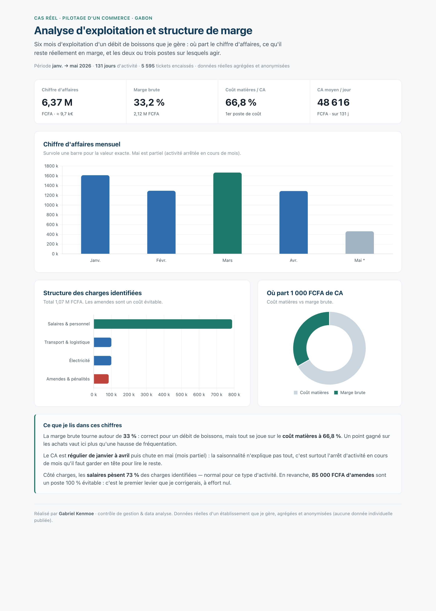
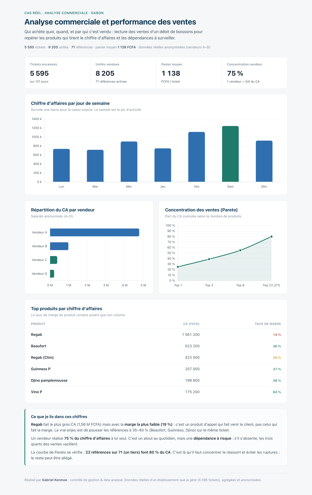
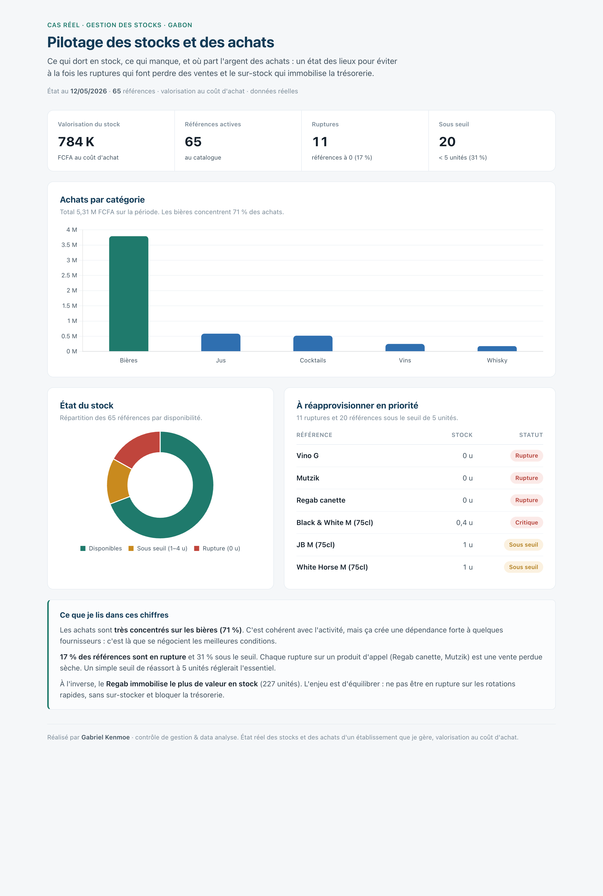
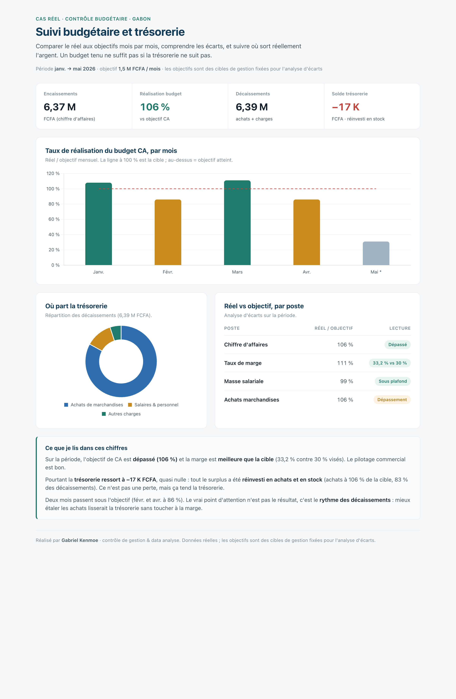
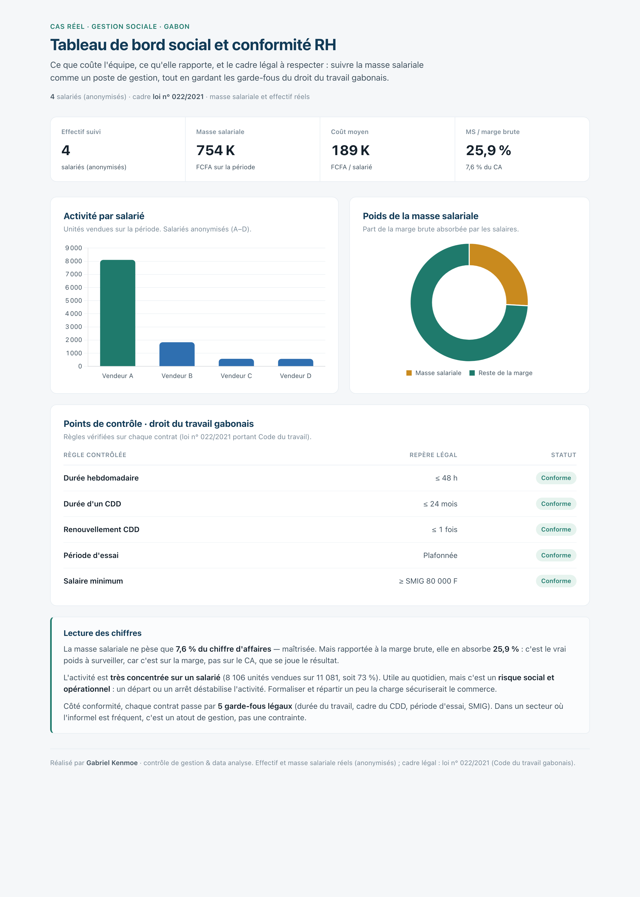

# Portfolio — Contrôle de gestion & Data analyse

Je m'appelle **Gabriel Kenmoe**. Je suis en MBA Audit et Contrôle de gestion, et en parallèle je gère un petit
commerce (un débit de boissons) que je pilote entièrement avec mes propres tableaux de bord.

Ce dépôt rassemble ces tableaux. Ce ne sont pas des données d'exercice : ce sont **mes chiffres réels**, sur six
mois d'activité, simplement agrégés et anonymisés. Les noms des vendeurs sont remplacés par Vendeur A à D, et
aucune donnée individuelle n'est publiée.

L'objectif est concret : montrer ce que je sais faire, c'est-à-dire partir de données brutes de ventes, d'achats
et de stock, et en tirer des décisions de gestion.

## Voir les tableaux de bord

Ils sont **interactifs** : on survole les graphiques pour lire les valeurs exactes.

**Portfolio en ligne : https://gabrielkemoe-glitch.github.io/controle-gestion-data-portfolio/**

### 1. Exploitation et structure de marge
Où part le chiffre d'affaires et ce qu'il reste vraiment en marge : coût matières, structure des charges, repères de gestion.
[Version interactive](dashboards/01-exploitation-marge.html)

### 2. Ventes et performance commerciale
CA par jour de semaine, part de chaque vendeur, top produits par marge et concentration des ventes (loi de Pareto).
[Version interactive](dashboards/02-ventes-performance.html)

### 3. Stocks et achats
Valorisation du stock, ruptures, seuils de réapprovisionnement et répartition des achats par catégorie.
[Version interactive](dashboards/03-stocks-achats.html)

### 4. Budget et trésorerie
Taux de réalisation du budget mois par mois, analyse d'écarts réel/objectif et suivi des décaissements.
[Version interactive](dashboards/04-budget-tresorerie.html)

### 5. Social et conformité RH
Masse salariale, poids sur la marge, ratios sociaux et garde-fous du droit du travail gabonais (loi n° 022/2021).
[Version interactive](dashboards/05-social-rh.html)

## Ce que ces tableaux mettent en avant

- **Contrôle de gestion** : marge brute, structure de coûts, analyse d'écarts budgétaires, suivi de trésorerie, ratios de masse salariale.
- **Data analyse** : nettoyage et agrégation de données réelles (ventes, achats, stocks), analyse ABC et Pareto.
- **Restitution** : chaque tableau se termine par une lecture analytique « ce que je lis dans ces chiffres », parce qu'un bon reporting explique, il ne se contente pas d'afficher.

## Outils

Excel, Google Sheets et SQL pour le travail sur les données. Les tableaux de bord de ce dépôt sont construits
en HTML et CSS, avec la librairie Chart.js pour la partie interactive.

## Tableau de bord interactif en ligne (Looker Studio)

En complément des tableaux ci-dessus, j'ai réalisé une version interactive et partageable du suivi des ventes avec Looker Studio, consultable en ligne sans connexion :

**[Ouvrir le tableau de bord interactif](https://datastudio.google.com/reporting/9dbfe331-65ca-423f-a191-22230cf2b6cc)**

Il présente les indicateurs clés (chiffre d'affaires, nombre de tickets, panier moyen, taux de réalisation du budget) et permet d'explorer le chiffre d'affaires par mois (avec l'objectif), par jour de la semaine, par vendeur et par produit. Montants en FCFA.

Une version Power BI de ce tableau est également en préparation.

## À propos des données

Les fichiers sources (ventes, achats, stocks) ne sont pas publiés : ils contiennent des données d'exploitation
confidentielles. Seules des valeurs agrégées et anonymisées apparaissent dans les tableaux.

## Me contacter

- Malt : https://www.malt.fr/profile/gabrielkenmoe
